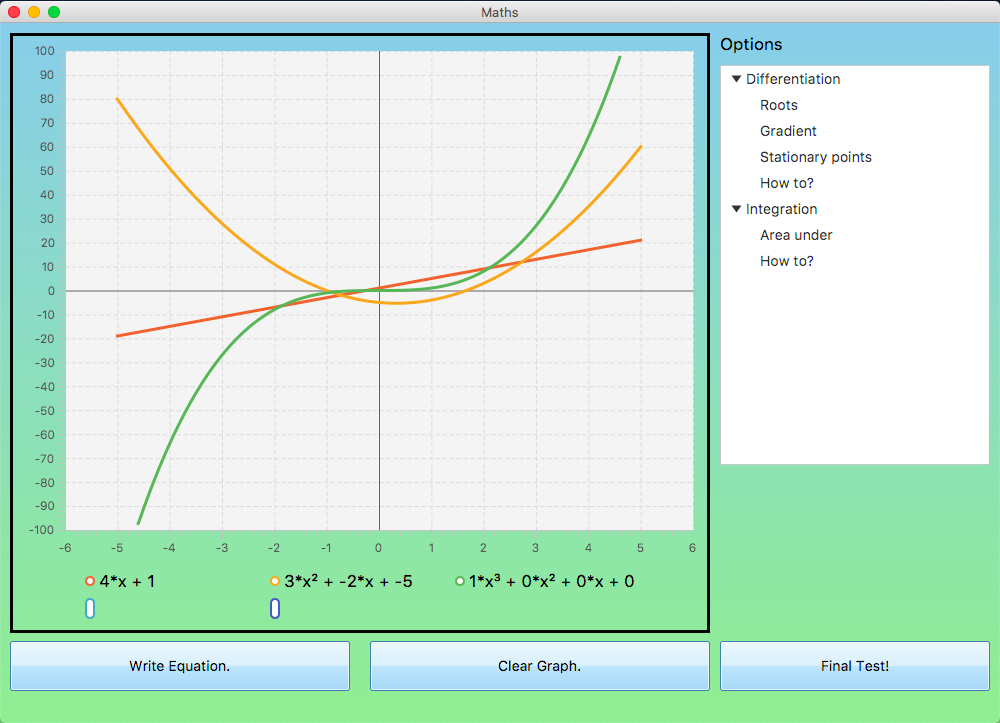
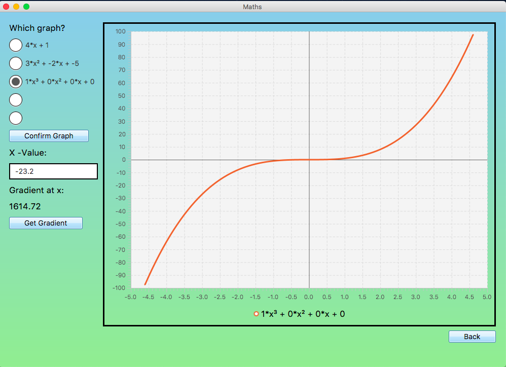
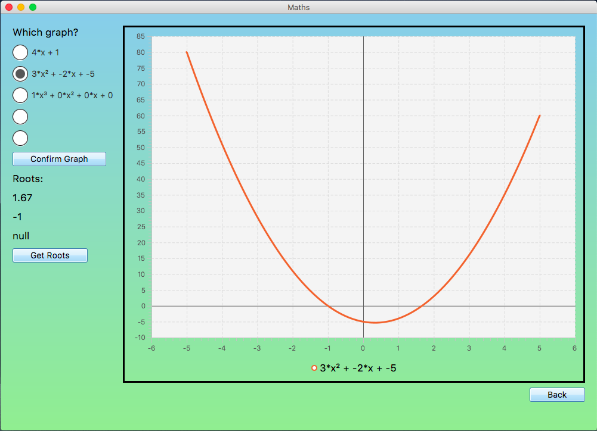
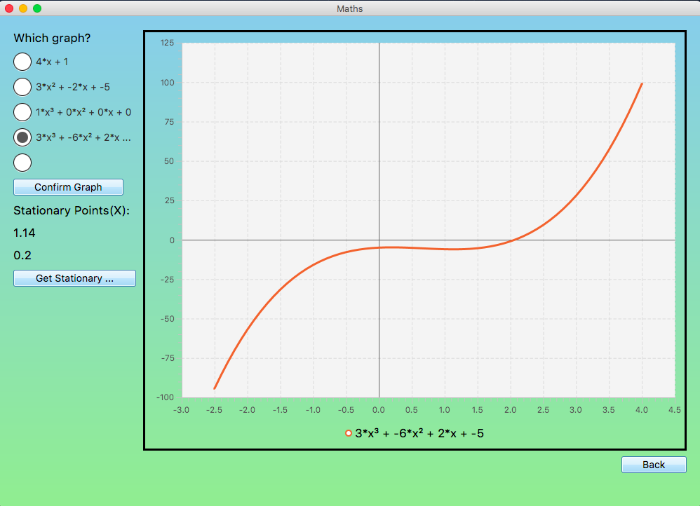
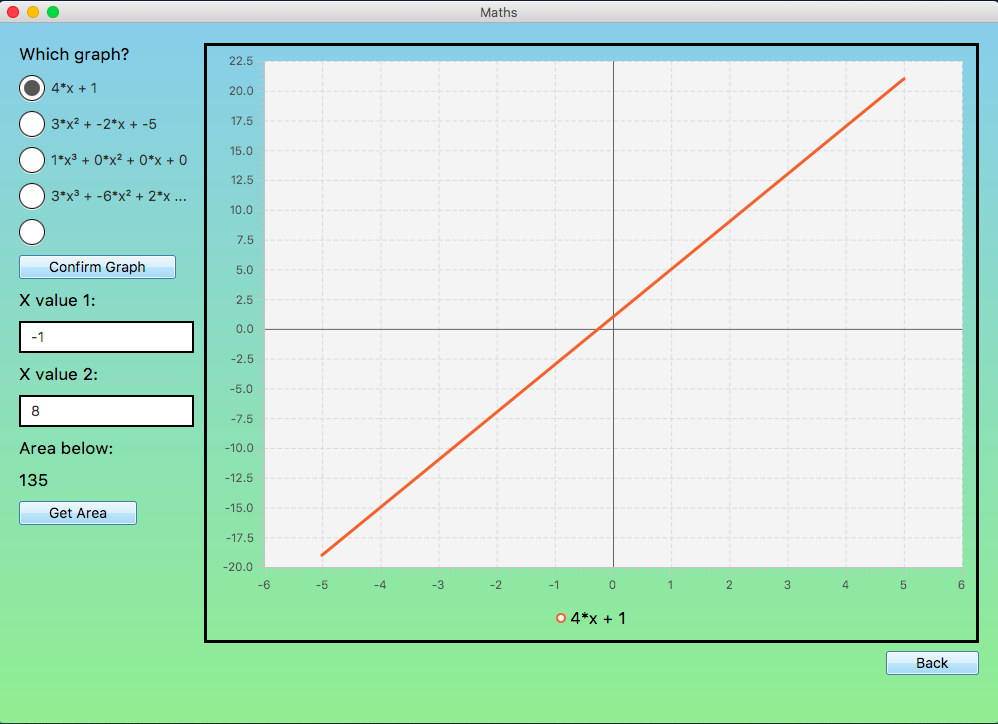
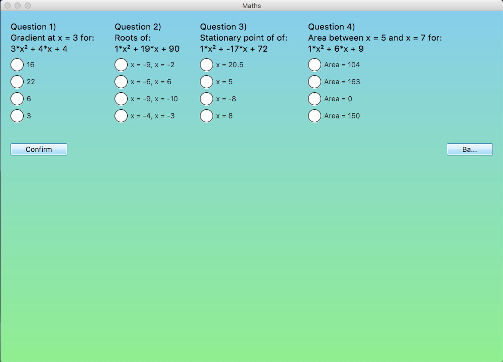

# Calculus Helper

> A project aimed to help A-level mathematics students with differentiation and integration.
> Developed for A2 Computer Science Coursework.

## Features

1.  Graph input / display

Input a number of graphs and display them on the screen:

-   Display _linear_, _quadratic_ or _cubic_ graphs

2.  Automatically calculate the **gradient** at any x-value of a graph

3.  Automatically calculate the **roots** of a graph

4.  Automatically calculate the **stationary points** of a graph

5.  Automatically calculate the **area** between two x-values under a graph

6.  Test your skills with a **randomly generated** test

